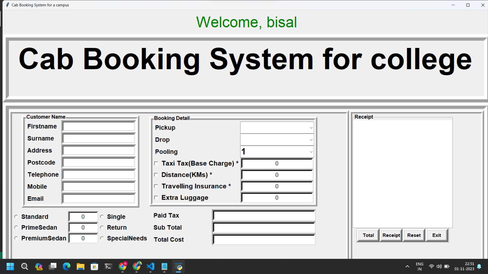

# Cab Booking System for a College Campus

Welcome to the Cab Booking System for a college campus, a simple application for booking cab services within a college campus. This application is designed to help students and staff easily book and manage taxi rides for their transportation needs. Here, we provide you with details on how to use the application, its features, and more.

## Details

This application is built using Python and the Tkinter library for the GUI. It also uses SQLite for the database to manage user accounts. You need to have Python installed on your system to run this application. The necessary modules used in the application are:

- `tkinter` for the graphical user interface.
- `random` for generating random reference numbers.
- `time` and `datetime` for working with date and time.
- `messagebox` from `tkinter` for displaying error messages.
- `sqlite3` for managing the user database.

## Features

- User authentication and account creation.
- Booking cab rides with options for different types of cars.
- Choosing pickup and drop-off locations within the campus.
- Selecting journey types (single, return, special needs).
- Calculating the total cost including tax, distance, and additional services.
- Generating a receipt for each booking.
- Resetting the input fields for a new booking.
- Exiting the application when done.

## Getting Started

To use this application, follow these steps:

1. Ensure you have Python installed on your system.
2. Clone the repository from GitHub.
3. Run the Python script `cabbooking.py`.

## How to Use

1. Log in with your existing account or create a new one.
2. Select pickup and drop-off locations.
3. Choose the journey type (single, return, special needs).
4. Check the additional services you require (taxi tax, distance, traveling insurance, extra luggage).
5. Select the type of car (standard, prime sedan, premium sedan).
6. Click the "Total" button to calculate the total cost.
7. Click the "Receipt" button to generate a receipt.
8. Click the "Reset" button to clear the input fields for a new booking.
9. Click the "Exit" button to exit the application.

## Screenshots

## Contributions

If you'd like to contribute to this project, please open an issue or submit a pull request on [GitHub](https://github.com/Bisalkumar/Cab-Booking-System.git).

## License

This project is licensed under the MIT License - see the [LICENSE](LICENSE) file for details.

## Acknowledgement

Special thanks to Python community  for providing the necessary modules that helped create this.